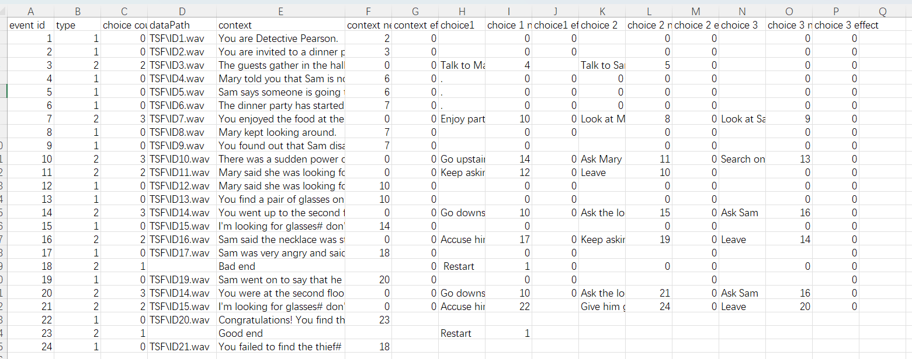

# (TODO: your game's title)

Author: Yue Wang, Ziqi Ye, Yiqu Zhu(yiquz)

Design&Gameplay(Yue Wang): A choice-based word detective game. The game is accompanied by voiceovers, making you more immersed.

Text Drawing(Ziqi Ye): We rendered all 128 ASCII code points to glyph textures during initialization, then read each char in the text, and choose the right glyph bitmaps to render on two triangles(a rectangle) in runtime.

Choices(Yiqu Zhu):the game store choices and narrative in .csv format, It is basically a directed graph. The editing pipeline is in Excel which can authored and save csv file easily. 
A tricky thing is that csv file use ',' as a parse signal, which we absolutely needed in a sentence. So I ask the narrative designer to use '#' when writing, and I replace all '#' with',' when reading and parsing the csv file.
It can also store wav file datapath

Screen Shot:

How To Play:

- Next: Space
- Choice: 1/2/3

Sources: [PressStart2P-Regular.ttf](https://fonts.google.com/specimen/Press+Start+2P)

This game was built with [NEST](NEST.md).

