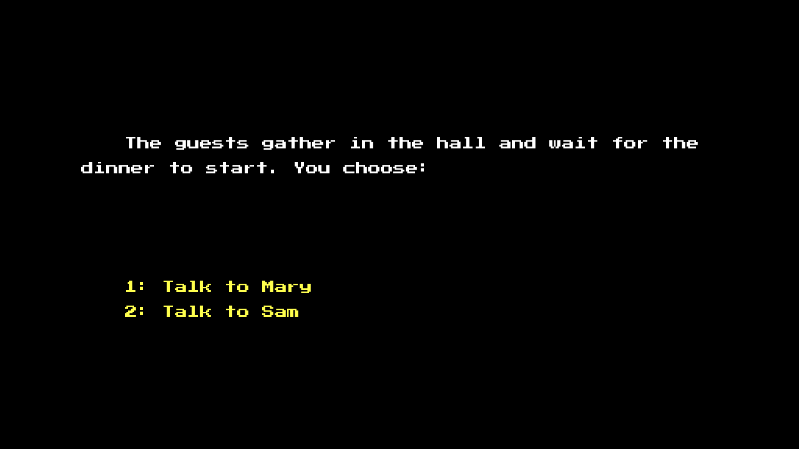

# Pearson's Bizarre Adventure

Author: Yue Wang, Ziqi Ye, Yiqu Zhu

Design: (TODO: In two sentences or fewer, describe what is new and interesting about your game.)

Text Drawing: We rendered all 128 ASCII code points to glyph textures during initialization, then read each char in the text, and choose the right glyph bitmaps to render on two triangles(a rectangle) in runtime.

Choices: (TODO: how does the game store choices and narrative? How are they authored? Anything nifty you want to point out?)

Screen Shot:

How To Play:

- Next: Space
- Choice: 1/2/3

Sources: [PressStart2P-Regular.ttf](https://fonts.google.com/specimen/Press+Start+2P)

This game was built with [NEST](NEST.md).

